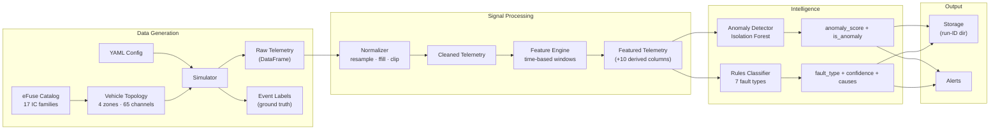
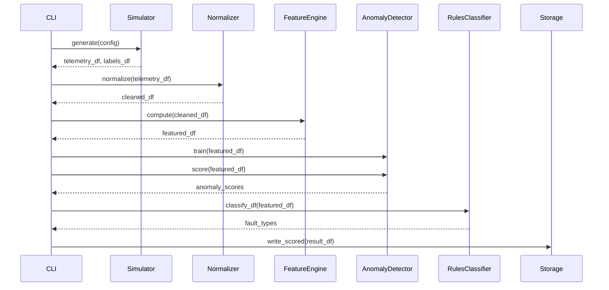
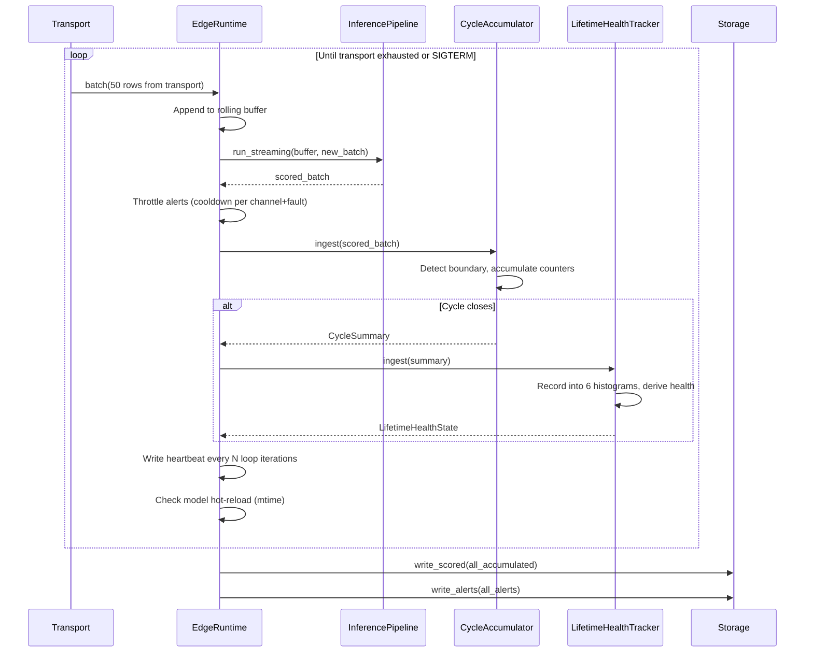
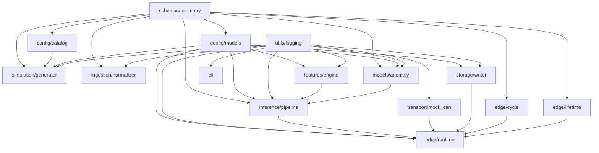

# Architecture

## System Context

This platform processes eFuse telemetry signals from vehicle electrical systems. Telemetry is synthetically generated using physics-based models that replicate real IC behavior — thermal response, protection cycling, load transients, and composite noise. The architecture supports two operating modes — **batch** (train models and run offline analysis) and **edge** (incremental scoring with real-time alerting and production hardening).

### Vehicle Electrical Architecture

```
Zone Controller (ECU)          Zone Controller (ECU)
┌──────────────────────┐       ┌──────────────────────┐
│  CDD (AUTOSAR SW)    │       │  CDD (AUTOSAR SW)    │
│  ┌─────┬─────┬─────┐ │       │  ┌─────┬─────┬─────┐ │
│  │eFuse│eFuse│eFuse│ │       │  │eFuse│eFuse│eFuse│ │
│  │HS-5A│HS-10│HS-20│ │       │  │LS-5A│HS-15│HS-50│ │
│  └──┬──┴──┬──┴──┬──┘ │       │  └──┬──┴──┬──┴──┬──┘ │
│     │SPI  │SPI  │SPI  │       │     │SPI  │SPI  │SPI  │
└─────┼─────┼─────┼────┘       └─────┼─────┼─────┼────┘
      │     │     │                   │     │     │
  Headlamp Wiper  Horn          Int.Light Mirror  HVAC
      ↓     ↓     ↓                   ↓     ↓     ↓
         CAN Bus (50-100ms)             CAN Bus (50-100ms)
              ↘                        ↙
               Gateway / XCP (10ms test)
                       ↓
              Telemetry Pipeline (this platform)
```

**Key distinction:** Zone Controllers are physical ECUs. The CDD (Complex Device Driver) is the AUTOSAR software layer inside each Zone Controller that reads eFuse registers over SPI. CAN carries production telemetry at 50–100ms. XCP is used only on test vehicles with 10ms + 50ms dual-raster DAQ.

## Pipeline Overview



## Operating Modes

### Batch Mode

Used for training and offline analysis. The CLI `pipeline` command runs this end-to-end.



### Edge Mode

Used for incremental inference. The `EdgeRuntime` maintains a rolling buffer, scores each mini-batch in context, and emits alerts for anomalies. Hardened with alert rate-limiting, heartbeat monitoring, model hot-reload, signal handling, and disk space protection.

Edge inference is driven by incoming row batches from the transport, not by a fixed 60-second timer. All three processing layers are implemented and wired into the runtime loop:



Three processing layers (all implemented):

1. **Streaming layer:** short rolling-window detection for overload spikes, voltage sag, protection trips, and thermal excursions.
2. **Cycle layer:** per-drive / per-charge / per-ignition summaries with stress scoring, dominant-fault identification, and health-band classification. Implemented in `CycleAccumulator`.
3. **Lifetime layer:** histogram-based load-spectrum tracking (6 histograms × 8 bins) with weighted health derivation and trend detection. Implemented in `LifetimeHealthTracker`.

## Module Dependency Graph



**Leaf modules** (no internal dependencies): `schemas/telemetry`, `utils/logging`.

## Vehicle Topology

### eFuse IC Catalog — 17 Families

Each family defines electrical and thermal defaults used by the simulator.

| Family | Nominal A | Max A | R_ds_on (Ω) | R_thermal (°C/W) | τ_thermal (s) |
|--------|-----------|-------|-------------|-------------------|---------------|
| `HS_2A` | 1.5 | 3 | 0.180 | 80 | 8 |
| `HS_5A` | 3.5 | 7 | 0.060 | 55 | 12 |
| `HS_10A` | 6 | 15 | 0.025 | 40 | 15 |
| `HS_15A` | 10 | 20 | 0.012 | 35 | 18 |
| `HS_20A` | 14 | 28 | 0.008 | 30 | 20 |
| `HS_30A` | 20 | 40 | 0.005 | 25 | 22 |
| `HS_50A` | 35 | 65 | 0.003 | 18 | 30 |
| `LS_5A` | 3 | 7 | 0.070 | 60 | 10 |
| `LS_15A` | 10 | 20 | 0.015 | 35 | 15 |

### Example Topology — 4 Zones, 65 Channels

| Zone | Location | Bus | CDD Cycle | Channels | Example Loads |
|------|----------|-----|-----------|----------|---------------|
| Rear | Rear module | CAN | 100ms | 25 | Seating, lighting, infotainment, ADAS, drivetrain |
| Body | Passenger cabin | CAN | 100ms | 15 | Doors, locks, cabin climate, body electronics |
| Front | Front module | CAN | 50ms | 15 | Power supply, HVAC, suspension, auxiliary loads |
| Central | Central gateway | CAN | 50ms | 10 | Power distribution, closures, reserves |

### Channel Factory

The `build_channels()` factory expands compact channel specs into full `ChannelMeta` objects:

1. Look up the eFuse family profile from `EFUSE_CATALOG`
2. Apply catalog defaults (R_ds_on, R_thermal, τ, nominal/max current)
3. Apply per-channel overrides (custom thresholds, load type)
4. Inherit `zone_id` and `source_protocol` from the Zone Controller

## Multi-Rate Protocol Support

| Protocol | Use Case | Rates | Transport Class |
|----------|----------|-------|-----------------|
| **CAN** | Production vehicles | 50–100ms per channel | `CanTransport` |
| **XCP** | Test benches | 10ms (fast) + 50ms (slow) dual-raster | `XcpTransport` |
| **Replay** | Offline analysis | From recorded Parquet/CSV | `ReplayTransport` |

The `FeatureConfig.resolve(sample_interval_s)` method auto-computes `window_size` and `min_periods` from time-domain settings (`window_duration_s`, `min_duration_s`), so the same config works across CAN (100ms) and XCP (10ms) without manual tuning.

## Data Schemas

### Telemetry Record (one row per sample per channel)

| Field | Type | Range | Description |
|-------|------|-------|-------------|
| `timestamp` | datetime | UTC | Sample time |
| `channel_id` | str | — | eFuse channel identifier |
| `current_a` | float | -1 to 200 A | Measured current |
| `voltage_v` | float | 0 to 60 V | Measured voltage |
| `temperature_c` | float | -40 to 150 °C | Junction temperature |
| `state_on_off` | bool | — | Channel power state |
| `trip_flag` | bool | — | Over-current trip active |
| `overload_flag` | bool | — | Overload condition detected |
| `reset_counter` | int | ≥ 0 | Cumulative reset count |
| `pwm_duty_pct` | float | 0–100 | PWM duty cycle % |
| `device_status` | enum | ok/warning/fault/unknown | Channel health state |

### ChannelMeta — Per-Channel Configuration

| Field | Type | Description |
|-------|------|-------------|
| `channel_id` | str | Unique ID (e.g., `body_interior_light_1`) |
| `efuse_family` | EFuseFamily | IC type from catalog (e.g., `HS_5A`) |
| `nominal_current_a` | float | Normal operating current |
| `max_current_a` | float | Absolute maximum before trip |
| `r_ds_on_ohm` | float | MOSFET on-resistance |
| `r_thermal_kw` | float | Thermal resistance (°C/W) |
| `tau_thermal_s` | float | Thermal time constant (s) |
| `adc_bits` | int | ADC resolution (8–16) |
| `pink_noise_alpha` | float | 1/f^α noise shaping (0=white, 1=pink) |
| `emi_amplitude_a` | float | EMI spike amplitude |
| `inrush_factor` | float | Turn-on current multiplier |
| `inrush_duration_ms` | float | Inrush transient decay time |
| `load_type` | str | `resistive`, `motor`, `inductive`, `ptc` |
| `sample_interval_ms` | float | Per-channel rate (0 = use global) |
| `source_protocol` | SourceProtocol | CAN / XCP / REPLAY |
| `zone_id` | str | Zone Controller assignment |
| `connected_loads` | list[str] | Vehicle loads on this channel |

### Derived Features (appended by FeatureEngine)

| Feature | Computation | Purpose |
|---------|-------------|---------|
| `rolling_rms_current` | √(rolling mean of current²) | Load magnitude regardless of sign |
| `rolling_mean_current` | Rolling window mean | Baseline trend |
| `rolling_max_current` | Rolling window max | Peak detection |
| `rolling_min_current` | Rolling window min | Dropout detection |
| `temperature_slope` | Finite difference over window | Thermal runaway detection |
| `spike_score` | (current − μ) / σ, clipped ≥ 0 | How many σ above normal |
| `trip_frequency` | Rolling sum of trip edges | Repeated protection triggers |
| `recovery_time_s` | Time since last trip release | How fast the channel recovers |
| `degradation_trend` | Least-squares slope of rolling mean | Long-term current increase |
| `missing_rate` | Rolling NaN ratio (pre-ffill) | Packet loss indicator |

### Inference Output

| Field | Type | Description |
|-------|------|-------------|
| `is_anomaly` | bool | Isolation Forest prediction |
| `anomaly_score` | float 0–1 | Higher = more anomalous |
| `predicted_fault` | FaultType enum | Rules classifier output |
| `fault_confidence` | float 0–1 | Classifier certainty |
| `likely_causes` | list[str] | Human-readable explanations |
| `recommended_action` | str | Suggested next step |

### CycleSummary — Per-Cycle Health Record

Produced by `CycleAccumulator` at cycle close. Held in RAM until uploaded.

| Field | Type | Description |
|-------|------|-------------|
| `cycle_id` | str | Unique UUID-based identifier |
| `cycle_type` | str | `ignition` / `drive` / `charge` |
| `open_timestamp` | datetime | Cycle start (UTC) |
| `close_timestamp` | datetime | Cycle end (UTC) |
| `duration_s` | float | Cycle length in seconds |
| `sample_count` | int | Total scored rows in cycle |
| `anomaly_count` | int | Rows with `is_anomaly == True` |
| `trip_count` | int | Rows with `trip_flag == True` |
| `retry_count` | int | Peak `reset_counter` value |
| `peak_current_a` | float | Max current observed (A) |
| `peak_temperature_c` | float | Max junction temp observed (°C) |
| `high_load_dwell_s` | float | Time above high-current threshold (s) |
| `high_temp_dwell_s` | float | Time above high-temp threshold (s) |
| `voltage_sag_dwell_s` | float | Time below low-voltage threshold (s) |
| `dominant_fault` | FaultType | Majority-vote fault |
| `dominant_fault_confidence` | float | Vote fraction for top fault |
| `cycle_stress` | float 0–1 | Weighted composite stress score |
| `health_band` | HealthBand | NOMINAL / MONITOR / DEGRADED / CRITICAL |

### LifetimeHealthState — Histogram-Based Load Spectra

Maintained by `LifetimeHealthTracker`. Six fixed-bin histograms (8 bins each) updated once per cycle close.

| Histogram | Unit | Edges (7) | Health Weight |
|-----------|------|-----------|---------------|
| `peak_current_hist` | A | 2, 5, 8, 12, 15, 20, 30 | 0.20 |
| `peak_temperature_hist` | °C | 40, 60, 80, 100, 120, 140, 160 | 0.20 |
| `cycle_stress_hist` | ratio | 0.05, 0.10, 0.15, 0.25, 0.40, 0.60, 0.80 | 0.20 |
| `trips_per_cycle_hist` | count | 1, 2, 3, 5, 8, 12, 20 | 0.15 |
| `retries_per_cycle_hist` | count | 1, 2, 3, 5, 8, 12, 20 | 0.10 |
| `thermal_dwell_frac_hist` | ratio | 0.01, 0.05, 0.10, 0.20, 0.35, 0.50, 0.75 | 0.15 |

Derived fields: `health_score` (1 − weighted upper-tail fractions), `health_band`, `trend` (IMPROVING / STABLE / DEGRADING / WORSENING), `cycle_count`.

Total memory: ~402 bytes (fits a single NvM block). See [07_metrics_reference.md](07_metrics_reference.md) for full metric definitions, formulas, and bin interpretations.

## Physics-Based Signal Models

### Thermal Model — First-Order RC

Junction temperature is computed iteratively per sample:

```
T_junction = T_ambient + P · R_thermal · (1 − e^(−t/τ))
P = I² · R_ds_on
```

Where `R_thermal`, `τ` (tau), and `R_ds_on` come from the eFuse family profile. Dynamic power dissipation is recalculated at each sample for realistic thermal response to load changes.

### Load-Specific Inrush Transients

| Load Type | Inrush Multiplier | Duration | Example |
|-----------|------------------|----------|---------|
| Resistive | 1.0× | — | Heaters, lights |
| Motor | 5.0× | 50ms | Power windows, wipers |
| Inductive | 3.0× | 20ms | Solenoids, horn, relays |
| PTC | 2.0× | 500ms | Cold-start thermistors |

### Composite Noise Model

Four noise components are summed per channel:

1. **Pink noise** (1/f^α) — spectral shaping with configurable α
2. **ADC quantization** — LSB = full_range / 2^adc_bits
3. **Thermal noise** — scales with √(T/T_ref)
4. **EMI spikes** — sporadic bursts at configurable amplitude

### eFuse Protection Simulation

Realistic trip → off → cooldown → retry → latch-off cycle:

1. **Detect overcurrent** (~3ms response time)
2. **Trip:** turn off channel, current drops to leakage
3. **Cooldown:** configurable per IC family (0.5–3s)
4. **Retry:** turn channel back on (may re-trip if fault persists)
5. **Latch off:** after max retries exhausted, channel stays off

## Simulated Fault Types

| Fault | What the simulator does | How the classifier detects it |
|-------|------------------------|-------------------------------|
| `overload_spike` | Spike current to 150% of max for ~3s, set trip_flag | spike_score > 4 AND trip_flag |
| `intermittent_overload` | Randomly spike 30% of samples | trip_frequency > 2 AND overload_flag |
| `voltage_sag` | Drop voltage to ~70% of nominal | voltage_v < 11 V |
| `thermal_drift` | Ramp temperature +40°C over window | temperature_slope > 0.3 |
| `noisy_sensor` | Add high-variance Gaussian noise | spike_score > 2.5 without trip/overload |
| `dropped_packet` | Set current/voltage to NaN randomly | missing_rate > 0.1 |
| `gradual_degradation` | Linear increase in current + temperature | degradation_trend > 0.01 |

## Edge Runtime Hardening

| Feature | Description | Config |
|---------|-------------|--------|
| Alert rate-limiting | Suppress duplicate channel+fault alerts within cooldown window | `alert_cooldown_s` (default 10s) |
| Heartbeat | Write `heartbeat.json` every N iterations for external monitoring | `heartbeat_interval` (default 5) |
| Model hot-reload | Detect model file mtime change, reload without restart | `model_hot_reload` (default true) |
| Signal handling | SIGINT/SIGTERM → graceful shutdown (finish current batch) | Always on |
| Error resilience | Track consecutive errors, crash after threshold | `max_consecutive_errors` (default 5) |
| Disk protection | Skip writes when free space drops below threshold | `disk_min_free_mb` (default 100) |
| Iteration metrics | Per-batch stats: inference_ms, rows, alerts, memory RSS | `RuntimeStats` / `IterationStats` |

## Structured Logging

All log records include a correlation `run_id` (format: `YYYYMMDD-HHMMSS-xxxx`) that ties together every log line from a single pipeline run.

| Mode | Flag | Output |
|------|------|--------|
| Pretty (default) | — | `2026-04-04 12:00:00 | module | INFO | [run_id] message` |
| JSON | `--json-log` | `{"ts":"…","level":"INFO","logger":"module","msg":"…","run_id":"…"}` |

JSON mode is designed for log aggregation pipelines (ELK, Datadog, etc.).

## Technology Stack

| Component | Technology | Rationale |
|-----------|-----------|-----------|
| Data contracts | Pydantic 2.x | Typed validation at system boundaries |
| Signal processing | pandas + numpy | Rolling windows, vectorized math |
| Anomaly detection | scikit-learn (Isolation Forest) | Unsupervised, lightweight, no GPU |
| Serialization | Parquet via pyarrow | Columnar, compressed, schema-preserving |
| Configuration | YAML via pyyaml | Human-readable, versionable scenarios |
| CLI | typer + rich | Typed options, formatted output, stderr separation |
| Model persistence | joblib | scikit-learn standard |

## Deployment Topology

| Component | Laptop | Edge (Jetson) |
|-----------|--------|---------------|
| Simulation + training | ✅ | — |
| Feature engine | ✅ | ✅ (smaller buffers) |
| Inference pipeline | ✅ batch | ✅ streaming |
| Cycle tracking | ✅ testing | ✅ target |
| Lifetime health tracking | ✅ testing | ✅ target |
| Edge runtime hardening | ✅ (testing) | ✅ (production) |
| Edge runtime | ✅ testing | ✅ target |
| Storage | ✅ parquet | ✅ parquet |
| Backend sync | — (future) | — (future) |

The trained model artifact (~100KB joblib file) is generated on the laptop and deployed to edge.
