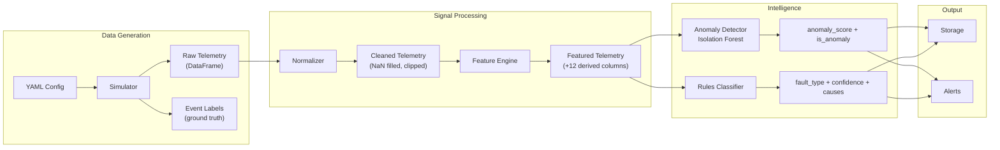
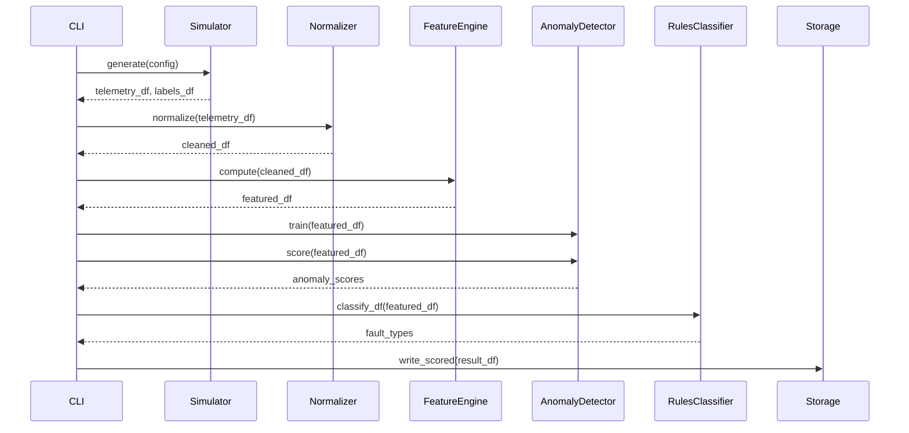
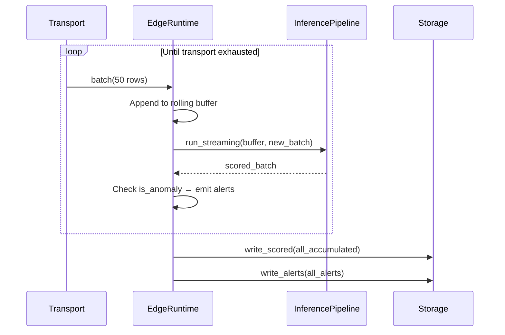
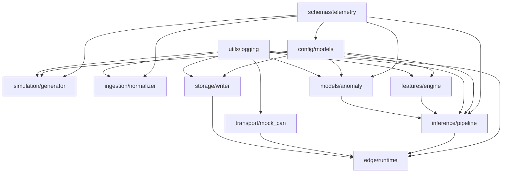

# Architecture

## System Context

This platform processes eFuse telemetry signals from vehicle electrical systems. In the MVP, telemetry is synthetically generated. The architecture supports two operating modes — **batch** (train models and run offline analysis) and **edge** (incremental scoring with real-time alerting).

## Pipeline Overview

## Operating Modes

### Batch Mode

Used for training and offline analysis. The CLI `pipeline` command runs this end-to-end.

### Edge Mode

Used for incremental inference. The `EdgeRuntime` maintains a rolling buffer, scores each mini-batch in context, and emits alerts for anomalies.

## Module Dependency Graph

**Leaf modules** (no internal dependencies): `schemas/telemetry`, `utils/logging`.
Everything else builds on top of these two.

## Data Schemas

### Telemetry Record (one row per sample per channel)

| Field | Type | Range | Description |
|-------|------|-------|-------------|
| `timestamp` | datetime | UTC | Sample time |
| `channel_id` | str | — | eFuse channel identifier |
| `current_a` | float | -1 to 200 A | Measured current |
| `voltage_v` | float | 0 to 60 V | Measured voltage |
| `temperature_c` | float | -40 to 150 °C | Junction temperature |
| `state_on_off` | bool | — | Channel power state |
| `trip_flag` | bool | — | Over-current trip active |
| `overload_flag` | bool | — | Overload condition detected |
| `reset_counter` | int | ≥ 0 | Cumulative reset count |
| `pwm_duty_pct` | float | 0–100 | PWM duty cycle % |
| `device_status` | enum | ok/warning/fault/unknown | Channel health state |

### Derived Features (appended by FeatureEngine)

| Feature | Computation | Purpose |
|---------|-------------|---------|
| `rolling_rms_current` | √(rolling mean of current²) | Load magnitude regardless of sign |
| `rolling_mean_current` | Rolling window mean | Baseline trend |
| `rolling_max_current` | Rolling window max | Peak detection |
| `rolling_min_current` | Rolling window min | Dropout detection |
| `temperature_slope` | Finite difference over window | Thermal runaway detection |
| `spike_score` | (current − μ) / σ, clipped ≥ 0 | How many σ above normal |
| `trip_frequency` | Rolling sum of trip edges | Repeated protection triggers |
| `recovery_time_s` | Time since last trip release | How fast the channel recovers |
| `degradation_trend` | Least-squares slope of rolling mean | Long-term current increase |
| `missing_rate` | Rolling NaN ratio (pre-ffill) | Packet loss indicator |

### Inference Output

| Field | Type | Description |
|-------|------|-------------|
| `is_anomaly` | bool | Isolation Forest prediction |
| `anomaly_score` | float 0–1 | Higher = more anomalous |
| `predicted_fault` | FaultType enum | Rules classifier output |
| `fault_confidence` | float 0–1 | Classifier certainty |
| `likely_causes` | list[str] | Human-readable explanations |
| `recommended_action` | str | Suggested next step |

## Simulated Fault Types

| Fault | What the simulator does | How the classifier detects it |
|-------|------------------------|-------------------------------|
| `overload_spike` | Spike current to 150% of max for ~3s, set trip_flag | spike_score > 4 AND trip_flag |
| `intermittent_overload` | Randomly spike 30% of samples | trip_frequency > 2 AND overload_flag |
| `voltage_sag` | Drop voltage to ~70% of nominal | voltage_v < 11 V |
| `thermal_drift` | Ramp temperature +40°C over window | temperature_slope > 0.3 |
| `noisy_sensor` | Add high-variance Gaussian noise | spike_score > 2.5 without trip/overload |
| `dropped_packet` | Set current/voltage to NaN randomly | missing_rate > 0.1 |
| `gradual_degradation` | Linear increase in current + temperature | degradation_trend > 0.01 |

## Technology Stack

| Component | Technology | Rationale |
|-----------|-----------|-----------|
| Data contracts | Pydantic | Typed validation at system boundaries |
| Signal processing | pandas + numpy | Rolling windows, vectorized math |
| Anomaly detection | scikit-learn (Isolation Forest) | Unsupervised, lightweight, no GPU |
| Serialization | Parquet via pyarrow | Columnar, compressed, schema-preserving |
| Configuration | YAML via pyyaml | Human-readable, versionable scenarios |
| CLI | typer + rich | Zero boilerplate, formatted output |
| Model persistence | joblib | scikit-learn standard |

## Deployment Topology

| Component | Laptop | Edge (Jetson) |
|-----------|--------|---------------|
| Simulation + training | ✅ | — |
| Feature engine | ✅ | ✅ (smaller buffers) |
| Inference pipeline | ✅ batch | ✅ streaming |
| Edge runtime | ✅ testing | ✅ target |
| Storage | ✅ parquet | ✅ parquet |
| Backend sync | — (future) | — (future) |

The trained model artifact (~100KB joblib file) is generated on the laptop and deployed to edge.
